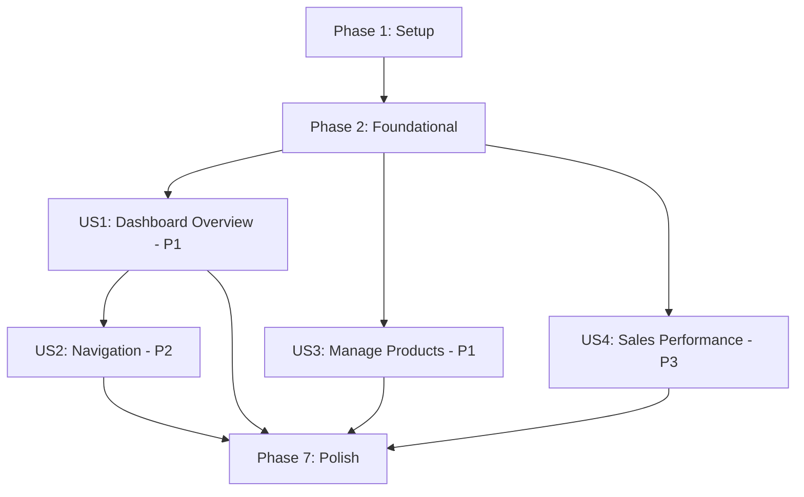

# Tasks: Seller Dashboard

**Input**: Design documents from `/specs/001-seller-dashboard/`  
**Prerequisites**: plan.md (required), spec.md (required for user stories), research.md, data-model.md, contracts/

**Tests**: Per constitution principle VI, tests are NOT REQUIRED and should NOT be included in task lists unless explicitly requested by the user for a specific feature.

**Organization**: Tasks are grouped by user story to enable independent implementation and verification of each story.

## Format: `[ID] [P?] [Story] Description`

- **[P]**: Can run in parallel (different files, no dependencies)
- **[Story]**: Which user story this task belongs to (e.g., US1, US2, US3, US4)
- Include exact file paths in descriptions

## Path Conventions

- **PHP MVC App**: `app/Models/`, `app/Views/`, `app/Controllers/`, `public/`, `config/`
- No `tests/` directory - testing not required per constitution principle VI
- Paths shown below assume PHP MVC structure as defined in plan.md

---

## Phase 1: Setup (Project Initialization)

**Purpose**: Initialize project structure and configuration files

 - [X] T001 Create directory structure: `app/Models/`, `app/Views/seller/`, `app/Views/seller/partials/`, `app/Controllers/`, `app/Core/`, `app/Helpers/`, `public/`, `public/css/`, `public/js/`, `config/`, `assets/images/`, `database/migrations/`
 - [X] T002 Create `.env.example` file in `config/` with database configuration placeholders (DB_HOST, DB_NAME, DB_USER, DB_PASS)
 - [X] T003 Create `.env` file in `config/` with actual database credentials (excluded from git)
 - [X] T004 Create `.gitignore` file in project root to exclude `config/.env`, `vendor/`, and system files
 - [X] T005 [P] Create `public/index.php` as application entry point with session initialization and router bootstrap

**Checkpoint**: Basic project structure ready for development

---

## Phase 2: Foundational (Blocking Prerequisites)

**Purpose**: Core infrastructure that MUST be complete before ANY user story can be implemented

**⚠️ CRITICAL**: No user story work can begin until this phase is complete

- [X] T006 Create database migration file `database/migrations/001_seller_dashboard.sql` with sellers, products, and orders tables including all indexes
- [X] T007 Execute migration against MySQL database to create tables
- [X] T008 Create `app/Core/Database.php` class with PDO connection using .env credentials and error handling
- [X] T009 [P] Create `app/Core/Router.php` class for MVC routing with GET/POST method support
- [X] T010 [P] Create `app/Helpers/SecurityHelper.php` with methods for CSRF token generation/validation, input sanitization, and output escaping
- [X] T011 [P] Create `app/Helpers/ValidationHelper.php` with methods for email validation, string length validation, and numeric validation
- [X] T012 Create session configuration in `public/index.php` with secure cookie settings (httponly, secure, samesite)

**Checkpoint**: Foundation ready - user story implementation can now begin in parallel

---

## Phase 3: User Story 1 - View Dashboard Overview (Priority: P1) 🎯 MVP

**Goal**: Seller can access dashboard and see business statistics plus recent active products

**Manual Verification**: Navigate to `/seller/dashboard` while logged in, verify statistics display correctly (total products, active listings, monthly sales, monthly revenue), verify 10-20 most recent active products shown with action buttons, verify sidebar navigation visible, verify page loads within 2 seconds

### Implementation for User Story 1

- [X] T013 [P] [US1] Create `app/Models/Seller.php` with methods: `findById($id)`, `findByEmail($email)` using prepared statements
- [X] T014 [P] [US1] Create `app/Models/Product.php` with methods: `getTotalCount($sellerId)`, `getActiveCount($sellerId)`, `getRecentActiveProducts($sellerId, $limit)` using prepared statements and composite index
- [X] T015 [P] [US1] Create `app/Models/Order.php` with methods: `getMonthlySalesCount($sellerId)`, `getMonthlyRevenue($sellerId)` filtering by current month and completed status
- [X] T016 [US1] Create `app/Controllers/SellerDashboardController.php` with `index()` method that checks authentication, fetches seller data, calls all statistics methods, fetches recent products, and passes data to view
- [X] T017 [US1] Implement `getStatistics($sellerId)` private method in `SellerDashboardController` that aggregates data from all models
- [X] T018 [P] [US1] Create `app/Views/seller/dashboard.php` main template with HTML structure, TailwindCSS CDN link, responsive grid layout (sidebar + main panel)
- [X] T019 [P] [US1] Create `app/Views/seller/partials/sidebar.php` with navigation links (Dashboard, Add Product, Product List, Orders, Account) and active state highlighting
- [X] T020 [P] [US1] Create `app/Views/seller/partials/statistics.php` displaying 4 statistics cards with TailwindCSS styling (total products, active listings, monthly sales, monthly revenue with currency formatting)
- [X] T021 [P] [US1] Create `app/Views/seller/partials/recent-products.php` looping through products array, displaying name/price/status, with Edit/Pause/Delete buttons
- [X] T022 [P] [US1] Create `app/Views/seller/partials/flash-messages.php` to display success/error messages from session and clear them after display
- [X] T023 [US1] Add route in `app/Core/Router.php`: `GET /seller/dashboard → SellerDashboardController@index`
- [X] T024 [US1] Add authentication check at start of `SellerDashboardController::index()` to redirect to `/seller/login` if not authenticated
- [X] T025 [US1] Add output escaping with `htmlspecialchars()` to all dynamic content in view templates
- [X] T026 [US1] Add "View All Products" link in recent products section when product count exceeds 20
- [X] T027 [US1] Add empty state message in `recent-products.php` partial when seller has zero products
- [X] T028 [US1] Verify dashboard page loads within 2 seconds by logging execution time in controller

**Checkpoint**: At this point, User Story 1 should be fully functional and manually verifiable - sellers can view their dashboard with accurate statistics and recent products

---

## Phase 4: User Story 2 - Navigate Seller Functions (Priority: P2)

**Goal**: Seller can use sidebar navigation to access different sections with visual feedback

**Manual Verification**: Click each sidebar link, verify navigation works, verify active menu item highlighted, test mobile sidebar toggle functionality

### Implementation for User Story 2

- [X] T029 [P] [US2] Update `app/Views/seller/partials/sidebar.php` to accept `$currentSection` parameter and add CSS classes for active state highlighting
- [X] T030 [P] [US2] Create `public/js/dashboard.js` with sidebar toggle function for mobile (classList.toggle on button click)
- [X] T031 [US2] Add sidebar overlay close functionality in `dashboard.js`: close on outside click and close on menu item selection (mobile only)
- [X] T032 [US2] Add hamburger toggle button in `app/Views/seller/dashboard.php` visible only on mobile screens (<768px) with onclick handler
- [X] T033 [US2] Add responsive CSS classes to sidebar in `sidebar.php`: hidden by default on mobile (`-translate-x-full`), always visible on desktop (`lg:translate-x-0`)
- [X] T034 [US2] Add `.sidebar-open` CSS class toggle in `dashboard.js` that applies `translate-x-0` to show sidebar on mobile
- [X] T035 [US2] Update `SellerDashboardController::index()` to pass `$currentSection = 'dashboard'` to view
- [X] T036 [US2] Add ESC key listener in `dashboard.js` to close mobile sidebar for accessibility
- [ ] T037 [US2] Test sidebar persists across page navigation by ensuring it's included in all seller page templates

**Checkpoint**: At this point, User Story 2 should be fully functional - navigation works on desktop and mobile with proper visual feedback

---

## Phase 5: User Story 3 - Manage Active Products (Priority: P1) 🎯 MVP

**Goal**: Seller can pause and delete products directly from dashboard with type-to-confirm delete safety

**Manual Verification**: Click Pause button and verify product status changes and disappears from active list, click Delete button and verify modal appears requiring exact product name to be typed, verify deletion only proceeds with correct name match

### Implementation for User Story 3

- [X] T038 [P] [US3] Add `pause($productId, $sellerId)` method to `app/Models/Product.php` that updates status to 'paused' using prepared statement with seller ownership verification
- [X] T039 [P] [US3] Add `delete($productId, $sellerId, $confirmName)` method to `app/Models/Product.php` that validates name match and updates status to 'deleted' with seller ownership verification
- [X] T040 [P] [US3] Create `pauseProduct($productId)` method in `app/Controllers/SellerDashboardController.php` with CSRF validation, ownership check, pause action, and flash message
- [X] T041 [P] [US3] Create `deleteProduct($productId)` method in `app/Controllers/SellerDashboardController.php` with CSRF validation, ownership check, name confirmation check, delete action, and flash message
- [X] T042 [US3] Add routes in `app/Core/Router.php`: `POST /seller/dashboard/products/{id}/pause → SellerDashboardController@pauseProduct` and `POST /seller/dashboard/products/{id}/delete → SellerDashboardController@deleteProduct`
- [X] T043 [P] [US3] Add CSRF token generation in `SellerDashboardController::index()` and pass to view: `$_SESSION['csrf_token'] = bin2hex(random_bytes(32))`
- [X] T044 [P] [US3] Create delete confirmation modal HTML in `app/Views/seller/partials/delete-modal.php` with product name display, text input for confirmation, and disabled confirm button
- [X] T045 [P] [US3] Add `showDeleteModal(productId, productName)` function to `public/js/dashboard.js` that populates modal, clears input, and shows modal
- [X] T046 [P] [US3] Add input validation in `dashboard.js` delete modal that enables confirm button only when typed name exactly matches product name (case-sensitive)
- [X] T047 [US3] Add `hideDeleteModal()` function to `dashboard.js` that closes modal and resets form state
- [X] T048 [US3] Update `app/Views/seller/partials/recent-products.php` to add Pause button with form POST and CSRF token
- [X] T049 [US3] Update `app/Views/seller/partials/recent-products.php` to add Delete button that calls `showDeleteModal()` with product ID and name
- [X] T050 [US3] Include delete modal partial in `app/Views/seller/dashboard.php` main template
- [X] T051 [US3] Add error handling in pause/delete controller methods to catch PDOException and show user-friendly error message
- [ ] T052 [US3] Verify statistics update after pause/delete by refreshing dashboard and checking product counts

**Checkpoint**: At this point, User Story 3 should be fully functional - sellers can pause and delete products with proper safety confirmation

---

## Phase 6: User Story 4 - View Sales Performance (Priority: P3)

**Goal**: Seller sees accurate monthly sales and revenue statistics on dashboard

**Manual Verification**: Create test order with 'completed' status for current month, refresh dashboard, verify monthly sales count increments and revenue reflects order total with proper currency formatting

### Implementation for User Story 4

- [X] T053 [P] [US4] Verify `app/Models/Order.php` methods `getMonthlySalesCount()` and `getMonthlyRevenue()` correctly filter by current month using MONTH() and YEAR() SQL functions
- [ ] T054 [P] [US4] Add date boundary test: verify statistics correctly reset on the 1st of new month by checking MONTH(order_date) = MONTH(CURRENT_DATE) condition
- [X] T055 [US4] Verify currency formatting in `app/Views/seller/partials/statistics.php` uses `number_format($revenue, 2)` with dollar sign prefix
- [X] T056 [US4] Add zero-state handling in statistics partial: display $0.00 when no completed orders exist for current month using `COALESCE(SUM(total_amount), 0)` in query
- [X] T057 [US4] Verify only orders with `order_status = 'completed'` count toward statistics (exclude pending, cancelled, refunded)

**Checkpoint**: At this point, User Story 4 should be fully functional - statistics accurately reflect current month performance

---

## Phase 7: Polish & Cross-Cutting Concerns

**Purpose**: Final touches, security hardening, error handling, and performance optimization

### Security Hardening

- [X] T058 [P] Review all view templates and ensure every variable output uses `htmlspecialchars($var, ENT_QUOTES, 'UTF-8')`
- [X] T059 [P] Review all SQL queries in models and verify they use prepared statements with parameter binding (no string concatenation)
- [X] T060 [P] Add input validation to all controller methods: validate product IDs with `filter_var($id, FILTER_VALIDATE_INT)`, validate seller ownership before any product action
- [X] T061 [P] Verify CSRF token validation in both pause and delete controller methods before any state change
- [X] T062 Add security headers in `public/index.php`: Content-Security-Policy, X-Frame-Options, X-Content-Type-Options

### Error Handling

- [ ] T063 [P] Wrap all database queries in try-catch blocks and log errors with `error_log()` while showing generic user-friendly messages
- [ ] T064 [P] Create custom error pages: 404 Not Found, 403 Forbidden, 500 Internal Server Error in `app/Views/errors/`
- [ ] T065 [P] Add database connection error handling in `app/Core/Database.php` with graceful degradation message
- [ ] T066 Add validation error messages for delete name mismatch, invalid CSRF token, and unauthorized product access

### Performance Optimization

- [ ] T067 [P] Verify database indexes exist on: `products(seller_id, status, modified_at)`, `orders(seller_id, order_status, order_date)` by running `SHOW INDEX` queries
- [ ] T068 [P] Add query execution time logging in development mode to identify slow queries (target <200ms for statistics, <100ms for products)
- [ ] T069 Optimize TailwindCSS delivery: verify CDN link uses caching headers, consider compiling for production if page weight exceeds 500KB
- [ ] T070 Verify dashboard page weight <500KB by checking browser DevTools Network tab (excluding external images)

### Responsive & Accessibility

- [ ] T071 [P] Test responsive layout on mobile (320px), tablet (768px), and desktop (1024px+) breakpoints
- [ ] T072 [P] Verify sidebar toggle button has proper ARIA labels for screen readers: `aria-label="Toggle navigation menu"`
- [ ] T073 [P] Add keyboard navigation support: sidebar toggle with Enter key, modal close with ESC key, focus trap in delete modal
- [ ] T074 Verify color contrast ratios meet WCAG AA standards for all text elements (4.5:1 for normal text)

### Edge Cases

- [ ] T075 [P] Test empty state: seller with 0 products shows helpful message with "Add Product" call-to-action link
- [ ] T076 [P] Test pagination boundary: seller with exactly 20 products shows all without "View All" link, 21+ products shows link
- [ ] T077 [P] Test long product names: verify truncation with ellipsis using TailwindCSS `truncate` class and full name on hover
- [ ] T078 Test very small mobile screens (<375px): verify layout remains functional without horizontal scroll
- [ ] T079 Test month boundary: manually set system date to last day of month, create order, advance to first day of next month, verify statistics reset to zero

### Documentation & Code Quality

- [ ] T080 [P] Add PHPDoc comments to all public methods in models and controllers with `@param` and `@return` annotations
- [ ] T081 [P] Create `README.md` in project root with setup instructions, database migration steps, and XAMPP configuration
- [ ] T082 Add inline code comments for complex business logic (e.g., monthly statistics calculation, type-to-confirm validation)
- [ ] T083 Verify consistent code style: PSR-12 for PHP, 2-space indentation for HTML/JS, consistent naming conventions

**Checkpoint**: All polish tasks complete - feature is production-ready

---

## Dependencies & Execution Strategy

### User Story Dependencies

### Story Completion Order

**Recommended MVP (Minimum Viable Product)**:
1. Phase 1 (Setup)
2. Phase 2 (Foundational)
3. Phase 3 (US1 - Dashboard Overview) ← **First deliverable**
4. Phase 5 (US3 - Manage Products) ← **Second deliverable**

**Post-MVP Enhancements**:
5. Phase 4 (US2 - Navigation improvements)
6. Phase 6 (US4 - Sales Performance)
7. Phase 7 (Polish)

### Parallel Execution Opportunities

**Within Phase 3 (US1)**: After T016 controller is created
- T013, T014, T015 (Models) can run in parallel
- T018, T019, T020, T021, T022 (Views) can run in parallel
- T025, T026, T027 (View enhancements) can run in parallel

**Within Phase 4 (US2)**: All tasks except T037
- T029, T030, T031, T032, T033, T034, T036 can run in parallel

**Within Phase 5 (US3)**: After T042 routes are added
- T038, T039 (Model methods) can run in parallel
- T040, T041 (Controller methods) can run in parallel
- T043, T044, T045, T046, T047, T048, T049 can run in parallel

**Within Phase 7 (Polish)**: Most tasks can run in parallel
- All security tasks (T058-T062) in parallel
- All error handling tasks (T063-T066) in parallel
- All performance tasks (T067-T070) in parallel
- All responsive tasks (T071-T074) in parallel

---

## Implementation Strategy

### Incremental Delivery Approach

**Sprint 1 (MVP - Core Dashboard)**: Phases 1-3
- **Deliverable**: Working dashboard showing statistics and recent products
- **Value**: Sellers can view their business overview
- **Estimated Time**: 4-5 hours
- **Manual Verification**: Login, view dashboard, verify statistics display

**Sprint 2 (Product Management)**: Phase 5
- **Deliverable**: Pause and delete functionality
- **Value**: Sellers can manage their product listings
- **Estimated Time**: 2-3 hours
- **Manual Verification**: Pause product, delete product with confirmation

**Sprint 3 (Polish)**: Phases 4, 6, 7
- **Deliverable**: Navigation enhancements, sales metrics, security hardening
- **Value**: Production-ready feature with all edge cases handled
- **Estimated Time**: 2-3 hours
- **Manual Verification**: Complete testing checklist from quickstart.md

### Total Estimated Time

- **Phase 1 (Setup)**: 30 minutes
- **Phase 2 (Foundational)**: 2 hours
- **Phase 3 (US1)**: 2.5 hours
- **Phase 4 (US2)**: 1 hour
- **Phase 5 (US3)**: 1.5 hours
- **Phase 6 (US4)**: 30 minutes
- **Phase 7 (Polish)**: 2 hours

**Total**: 10 hours (experienced PHP developer)

---

## Task Summary

**Total Tasks**: 83
- **Phase 1 (Setup)**: 5 tasks
- **Phase 2 (Foundational)**: 7 tasks
- **Phase 3 (US1 - Dashboard Overview)**: 16 tasks
- **Phase 4 (US2 - Navigation)**: 9 tasks
- **Phase 5 (US3 - Manage Products)**: 15 tasks
- **Phase 6 (US4 - Sales Performance)**: 5 tasks
- **Phase 7 (Polish)**: 26 tasks

**Parallelizable Tasks**: 51 tasks marked with [P] can run in parallel within their phase

**Story Coverage**:
- US1 (P1): 16 tasks - Dashboard display and statistics
- US2 (P2): 9 tasks - Navigation and mobile responsiveness
- US3 (P1): 15 tasks - Product pause/delete actions
- US4 (P3): 5 tasks - Sales performance metrics

**Independent Testing**:
- Each user story phase includes manual verification criteria
- No automated tests per constitution principle VI
- Manual testing checklist in quickstart.md covers all scenarios

---

## Format Validation ✅

All 83 tasks follow the required checklist format:
- ✅ Checkbox prefix `- [ ]`
- ✅ Sequential Task ID (T001-T083)
- ✅ [P] marker for parallelizable tasks (51 tasks)
- ✅ [Story] label for user story tasks (US1, US2, US3, US4)
- ✅ Descriptive text with exact file paths
- ✅ Organized by phase and user story
- ✅ Dependencies clearly documented

**Ready for Implementation** 🚀
